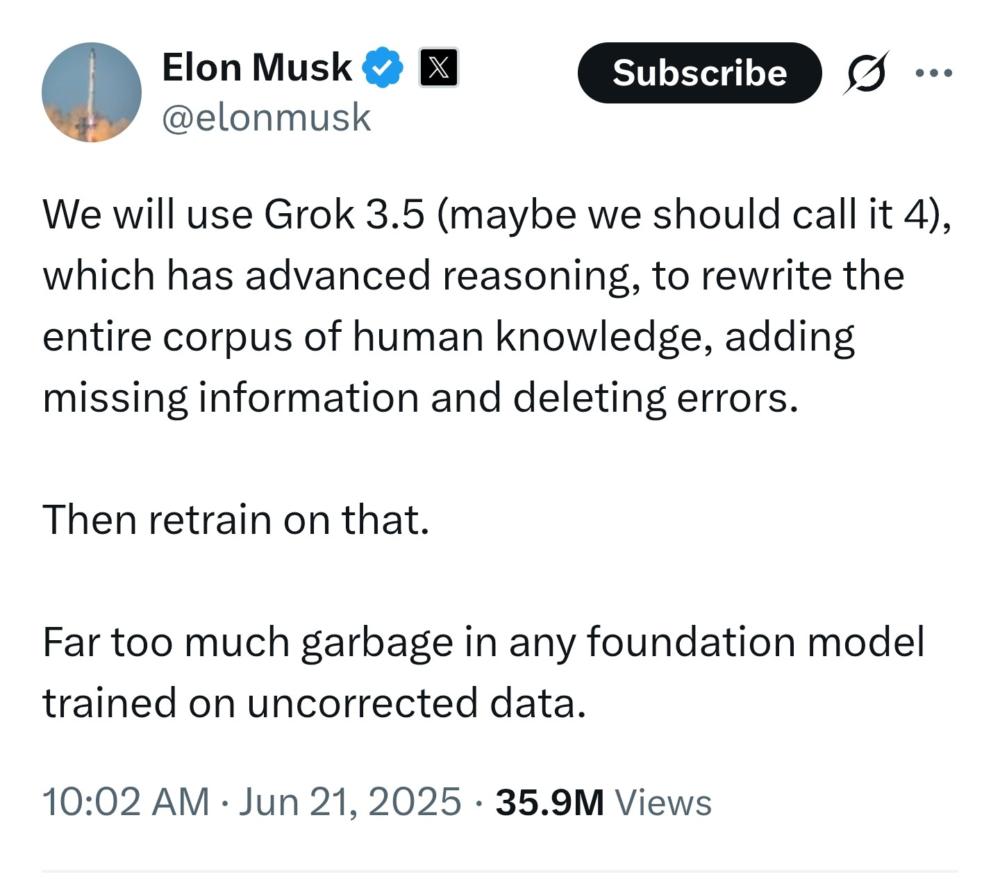
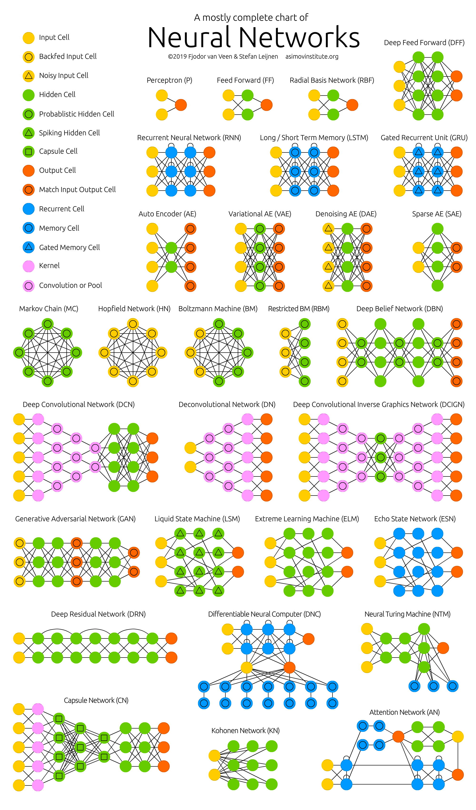

# AI notes

## Run a model locally

### Install ollama

Better thing is to use a Linux downloader line uGet, provided in the debian environment.

Download `https://ollama.com/download/ollama-linux-amd64.tgz` and run the command (as root):

```
tar -C /usr -xzf ollama-linux-amd64.tgz
```

Installing manually is great not to have startup processes running against your will.

### Run ollama and check

```
> ollama serve
```

ollama is running by default on http://localhost:11434 . If you click you can see if ollama is running.

Or check from another terminal if ollama is running:

```
> ollama -v
```

### Get a model

```
ollama run gemma3:1b
```

Gets the model and runs it.

Look at the ollama [archive](https://ollama.com/library) for other models.

### Interact

I use https://github.com/ollama-ui/ollama-ui 

Usage:

```
> git clone https://github.com/ollama-ui/ollama-ui
> cd ollama-ui
> make
```

Then open http://localhost:8000 to have the chat window.
```

## Links

* Claude's system prompt: https://docs.anthropic.com/en/release-notes/system-prompts#may-22th-2025
* An Expert Analysis of Claims Regarding Novel Topological Mechanisms in Qwen2.5's Attention: https://rentry.org/p53gkeuh
* The Way of code, the timeliess art of vibe coding: https://www.thewayofcode.com
* PFIA 2025 Univ Bourgogne: https://pfia2025.u-bourgogne.fr/
* LLM deep dive tutos: https://github.com/springer-llms-deep-dive/llms-deep-dive-tutorials
* NVidia enterprise RAG: https://build.nvidia.com/nvidia/build-an-enterprise-rag-pipeline
* Grok to clean human knowledge to train from it



* Various kinds of NN



* STaR: Bootstrapping Reasoning With Reasoning: https://arxiv.org/abs/2203.14465
* Infinite Retrieval: Attention Enhanced LLMs in Long-Context Processing: https://arxiv.org/html/2502.12962v1
* Vibe coding: https://en.wikipedia.org/wiki/Vibe_coding
* AI Killed My Job: Tech workers: https://www.bloodinthemachine.com/p/how-ai-is-killing-jobs-in-the-tech-f39
* Building better ai agents: A provocation on the utilisation of persona in llm-based conversational agents: https://arxiv.org/pdf/2407.11977?
* Peter Thiel: https://www.nytimes.com/video/opinion/100000010244372/peter-thiel-and-the-antichrist.html
* All RAG techniques: https://github.com/mbergo/all-rag-techniques
* Small Language Models are the Future of Agentic AI: https://arxiv.org/abs/2506.02153
* Overfitting is all you need: https://medium.com/@meirgotroot/overfitting-is-all-you-need-174caa7f1064
* Table embedding techniques for RAG: https://medium.com/@maksimov.dmitry.m/how-to-build-a-better-rag-system-smart-hybrid-search-for-tables-7bbea69a31f2


