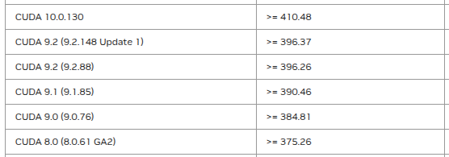
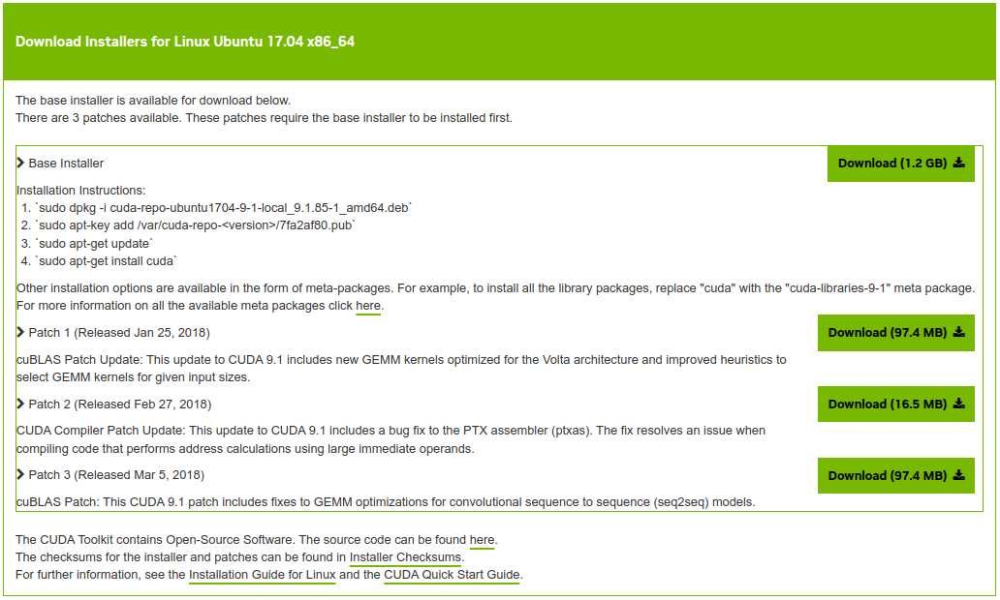

# CUDA notes

## CUDA for GF116 - GTX 550Ti

### Driver for screen

The last driver version is 390.157.

https://www.nvidia.com/en-us/drivers/details/196213/

### CUDA driver

The last theoretically compatible CUDA driver is the 9.1. The graphical driver must be `>= 390.46`.



Source: https://docs.nvidia.com/cuda/cuda-toolkit-release-notes/index.html

### Where to find the CUDA driver 9.1.85?

https://developer.nvidia.com/cuda-91-download-archive?target_os=Linux&target_arch=x86_64&target_distro=Ubuntu&target_version=1704&target_type=deblocal



Problem: The run files do not work on Debian 12. I did not try the deb packages manually.

The real packages of CUDA 9.1 are here: https://developer.download.nvidia.com/compute/cuda/repos/ubuntu1704/x86_64/

### Procedure with `synaptic`

1. Add a line in `/etc/apt/sorces.list.d/nvidia-drivers.list` to integrate the old source

```
deb https://developer.download.nvidia.com/compute/cuda/repos/ubuntu1704/x86_64/	/
```

2. Add the public key of the repo that can be found at the root of the repo (deprecated in Debian 12) : `apt-key add 7fa2af80.pub `

```
W: https://developer.download.nvidia.com/compute/cuda/repos/ubuntu1704/x86_64/Release.gpg: Key is stored in legacy trusted.gpg keyring (/etc/apt/trusted.gpg), see the DEPRECATION section in apt-key(8) for details.
```

3. Refresh packages: `apt update`

4. I was bound to go to `synaptic` in order to remove previous attempts to install CUDA (version 11 and 10). I also desinstalled a previous graphical driver (575) that was not used (since I use the 390).

5. The meta-package `cuda-9-1` should appear in `synaptic`. For me, it was not installable. So, I installed first `cuda-runtime-9-1` (meta-package).

6. Then I installed `cuda-9-1`. The installation is quite long because it is downloading a lot of packages.

7. I then installed `cuda-core-9-1`.
