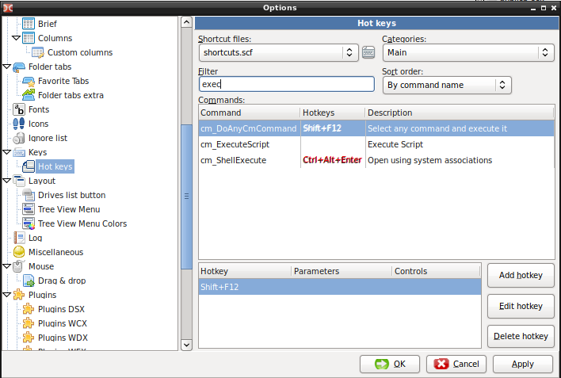
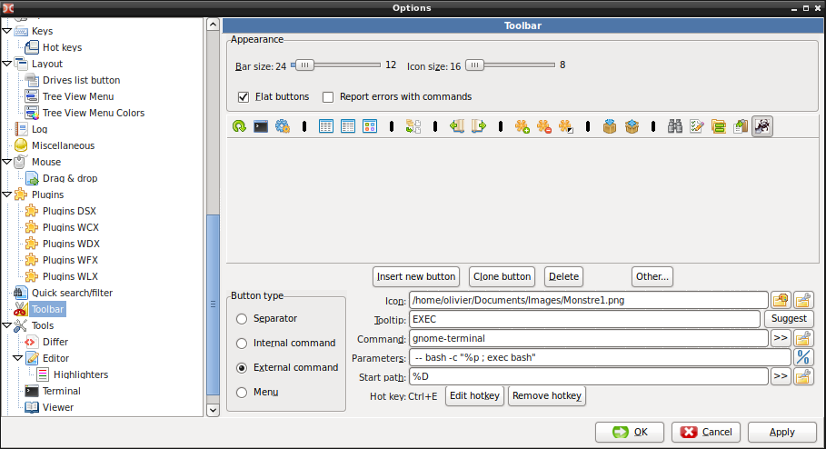

# DoubleCommander

## Run a command from DoubleCommander

Strangely, for me, the internal command `CTRL+ALT+ENTER` mapped on the internal command `cm_ShellExecute` does not work.



I found a work around by creating a new button and associating a new shortchut `CTRL+E`.



This works pretty well.

Note that it starts a script in a new terminal window and execute it. To be able to close the terminal when the execution is done, I just found this way:

```
function pause(){
   read -p "$*"
}

echo "Done"
pause 'Press [Enter] key to continue...'

kill -9 $PPID

```

It suspends the script so that you see the output and then closes the terminal.


