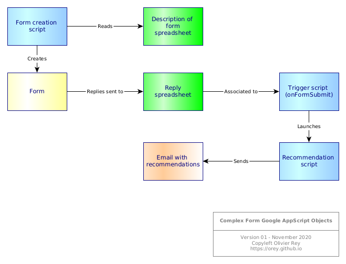

# Complex Recommendation Google Form

The following schema explains the various Google Workspace objects that are required to create this complex form.

The specifications were the following:

* As the form is complex, its description is in a specific spreadsheet. This enables the form to be recreated on demand with new questions without entering into the standard form edition process.
* The form is parameterized to output its data in a spreadsheet.
* A trigger is attached to the spreadsheet (`onFormSubmit`). This trigger is also associated to a manifest requiring some authorizations.
* This trigger calls the recommendation engine by passing `e.namedValues` to the script with the recommendation algorithm. This script sends an email to the user with the result of the processing.

