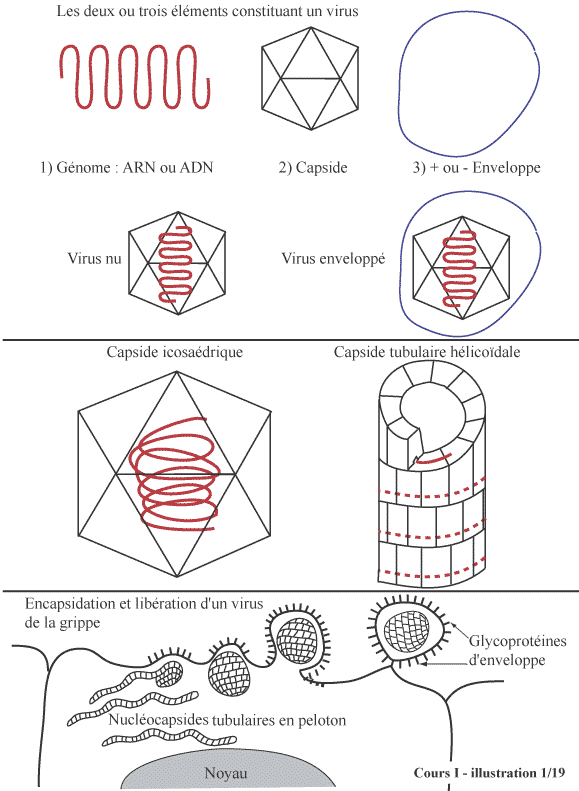
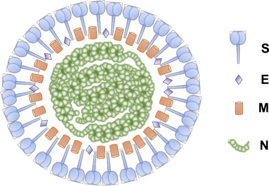

# Notes sur le Covid

Cet article est un ensemble de liens et de notes personnelles sur le Covid.

Dernière mise à jour : 24 juillet 2021

## A propos des coronavirus

### Structure

Les coronavirus sont des virus ARN de grande taille (de 26 000 à 32 000 bases), cause de maladies respiratoires comme le rhume. Le brin d'ARN des coronavirus est enveloppé d'une capsule appelée capside et d'une envelope nommée péplos.



*Figure 1 : structure des virus. Crédit image (L1)*

L'enveloppe est parsemée de petits "pics", des glycoprotéines nommées péplomère, spicule, protéine S ou "spike" pour reprendre le terme anglais.



*Figure 2 : Image d'un coronavirus. Crédit image (l2)*

La figure 2 montre un schéma de coronavirus.

Légende :

* S : protéines spike,
* E : protéines de l'enveloppe,
* M : protéines de la membrane,
* N : protéines de la capsule.

### Variants

Les coronavirus sont des virus créant des variants. Les variants peuvent être obtenus de deux façons :

* Les mutations,
* Les recombinaisons avec d'autres virus, soit de la même souche, de la même espèce voir d'une autre espèce (toujours à ARN).

### Mutations

Les coronavirus sont des virus qui mutent peu.

La mutation d'un virus est un phénomène dû aux erreurs de "recopie" des virus lors de leur duplication dans la cellule. L'enzyme en charge de la recopie des virus fait généralement des erreurs de recopie, ce qui provoque des mutations.

Les coronavirus mutent peu car l'enzyme permettant leur recopie est mùunioe d'un dispositif pour "corriger les erreurs". En revanche, cette enzyme permet la recombinaison du virus recopîé avec un autre virus déjà présent dans la cellule.

### Des virus recombinant

Les coronavirus se recombinent facilement voire très facilement durant leur duplication dans la cellule, lorsqu'il y a présence d'un autre virus.

L'autre virus peut être :

* Un autre variant du même coronavirus,
* Un autre coronavirus.

Ces recombinaisons donnent des variants pouvant être plus ou moins robustes que le virus d'origine. Généralement, les propriétés du virus sont affectées par ces recombinaisons.

L'émergence de variants est structurelle pour les coronavirus et le cas de la grippe est significatif.

### Polémique sur la nature des variants

De nombreuses discussions établissent une polémique sur la nature des variants avec le raisonnement suivant :

* Si les variants sont causés principalement par des mutations normales, fruit des erreurs de recopie, alors il faut que tout le monde soit vacciné pour éradiquer le virus pour que ce dernier ne se duplique plus et ne génère plus de variants ;
* Si les variants sont causés principalement par des recombinaisons avec d'autres souches, alors le vaccin lui-même est un potentiel catalyseur de variants, auquel cas il est sans doute raisonnable de ne vacciner que la partie la plus faible de la population et laisser l'autre partie porter la souche originale de sorte que la souche originale entre en concurrence avec les variants et reste présente.

Si l'on en croit Wikipedia en langue anglaise, site que l'on ne peut pas taxer de "complotisme" :

```
RNA recombination appears to be a major driving force in determining genetic variability within a coronavirus species, the capability of a coronavirus species to jump from one host to another and, infrequently, in determining the emergence of novel coronaviruses.
```

Un article chinois est cité (A4) pour appuyer ce constat. La conclusion partage le constat : 

```
The result from a high frequency of recombination events in CoVs is the generation of novel viruses with a high genetic diversity, with unpredictable changes in virulence during human infections. With multiple species of CoVs circulating in the wild amongst different animal species that may constantly interact with one another, it is likely not a matter of if, but when, the next recombinant CoV will emerge and cause another outbreak in the human population.
```

## Les vaccins contre le Covid
### Différents types de vaccins


*Figure 2 : les différents types de vaccins*

Essentiellement, aujourd'hui, on compte quatre types de vaccins dont deux par thérapie génique. La figure 2 ci-dessus tente de synthétiser leur mode de fonctionnement.

### Les vaccins historiques

Les vaccins classiques (par exemple celui contre la grippe) sont basés sur l'injection de virus dits désactivés. Ces virus infectent des cellules et provoquent une réponse immunitaire qui permettra au corps de produire des anticorps protégeant contre le vrai virus quand il se présentera.

Etant donné que les virus mutent, chaque année, de nouvelles souches désactivées sont introduites dans le vaccin pour que notre organisme s'adapte aux nouvelles menaces.

Le vaccin doit donc être renouvelé tous les ans et il est considéré comme ayant une bonne efficacité.

### Les nouveaux vaccins

Les nouveaux vaccins utilisent un processus plus complexe pour stimuler l'immunité : ils font produire à nos cellules la protéine "spike" qui se trouve sur l'enveloppe du coronavirus dans le but que cette protéine se fixe sur les parois de nos cellules infectées (par le vaccin) et déclenche une réponse immunitaire.

Il existe deux types de nouveaux vaccins :

* Les vaccins à ARN messager (type Pfizzer),
* Les vaccins à ADN (type Astra-Zeneca).

Ces vaccins sont souvent appelés thérapie génique un peu à tort car ils ne manipulent pas les gènes. Mais ce sont des thérapies génétiques dans la mesure où ils ont un effet structurel sur les cellules touchées. Nous reviendrons sur ce point.

Historiquement, les thérapies géniques consistent en un prélèvement des cellules défaillantes d'une personne, en leur correction en modifiant le gène défaillant et en réinjectant des cellules "corrigées". Le traitement est donc personnalisé.

### Les risques avec les nouveaux vaccins

Il est très compliqué de se faire une idée objective des risques causés par ces nouveaux vaccins, qui doivent, sans doute, être considérés comme des vaccins "d'urgence".

En effet, les effets secondaires de beaucoup de médicaments ne se manifestent qu'après *une grande période de temps*, temps qui n'a pas été pris avant la mise sur le marché de ces vaccins.

En simplifiant, nous pouvons dire que trois processus complexes et fragiles existent dans notre organisme :

* L'immunité,
* Le fertilité,
* La croissance.

Ces processus complexes mettent en cause de nombreuses fonctions biologiques, ce qui fait qu'elles sont sensibles aux petites perturbations.

Dans tous les cas, *avec des vaccins expérimentaux*, il nous paraît déraisonnable de vacciner les enfants en période de croissance et les adultes en âge de procréer, au risque de bouleverser les deux processus complexes que sont la croissance et la fertilité, processus dont les troubles ne se manifestent qu'au bout d'un temps souvent long.

La suite de cet article recense les risques répertoriés analysés par un scientifique n'appartenant pas au domaine médical mais ayant des bases.

### Sur la toxicité de la protéine spike

De nombreuses études ont montré que les formes graves de la maladie du Covid étaient dues à la protéine spike (notamment les coagulations et saignements). Ces formes sont liées à une circulation de la protéine spike dans le sang. Cette dernière se fixe sur des récepteurs ACE2, et donc sur les plaquettes sanguines (ce qui cause caillots ou saignements), mais aussi sur le coeur ou dans le cerveau.

Les effets de problèmes cardiaques chez les jeunes sont aujourd'hui expliqués par ce phénomène.

La suspension du vaccin Astra-Zeneca par certains pays est aujourd'hui en grande partie due à ces effets indésirables. Mais le vaccin Pfizzer est dans la même situation.

**Backgound**

Les premières données sur le sujet datent d'un article paru dans Nature en décembre 2020 expliquant un comportement de la protéine spike capable d'entrer dans le cerveau et dans certains organes de souris (A3).

Cet article est cité dans un article de mai 2021 paru dans [lifesitenews.com](https://www.lifesitenews.com) où des chercheurs indiquent que les effets de caillots sanguins et de troubles cardiaques pourraient être dus à ce phénomène de toxicité de la protéine spike.

Une étude japonaise démontre en effet que durant plusieurs jours après la vaccination, la protéine spike circule dans le sang et s'accumule dans des organes la moelle épinière, le foie, les testicules ou les ovaires.

### Les risques inhérents au vaccin à ARN de synthèse

Dans les vaccins à ARN, un ARN de synthèse est injecté dans notre organisme. Ce dernier contient l'information génétique de codage de la protéine spike.

Evidemment, nous voyons que cette technique peut être faillible pour plusieurs raisons :

* L'ARN peut synthétiser une protéine déficiente ;
* L'ARN peut synthétiser d'autres protéines ou altérer la synthèse d'autres protéines ;
* L'ARN peut interagir avec d'autres ARNs présents dans la cellule, notamment de coronavirus, et créer des variants qui, à leur tour, peuvent se dupliquer.

Le problème de fond est dual :

* La cellule est un environnement complexe dans lequel il n'est jamais certain qu'un facteur de combinaisons ne produira pas un effet inattendu ;
* Les brins d'ARN possèdent un certain potentiel de création de protéines et il n'est pas certain que nous connaissions toutes leurs potentialités (sinon, les thérapies géniques seraient généralisées).

En injectant de l'ARN, nous favorisons un comportement connu de ce brin d'ARN mais sans pouvoir affirmer qu'un comportement inconnu ne prendra pas le dessus dans le contexte cellulaire dans lequel il est mis en place.

### Les risques inhérents au vaccin à ADN (adenovirus)

De nouveaux risques se rajoutent :

* Une contamination par l'adénovirus qui transporte le code génétique de création de la protéine spike (évidemment ce virus est supposé être désactivé),
* La réplication de cet adénovirus (qui normalement, est impossible),
* L'inclusion de cet adénovirus dans le code génétique de l'hôte (normalement impossible).

Ces risques sont inhérents à deux facteurs :

* La capacité d'ingénierie génétique et sa fiabilité,
* Les circonstances particulières de certains patients pouvant déclencher des "effets de bord" par rapport aux comportements attendus de ces adenovirus.

### Le risque inhérent à l'augmentation de la complexité du processus de stimulation de l'immunité

Les vaccins à virus désactivés sont relativement simple : ils contaminent des cellules mais peu et avec peu de virulence. Ils agissent donc comme une stimulation du système immunitaire.

Les vaccins à ARN introduisent une complexité supplémentaire : celle de faire produire à nos cellules des éléments étrangers et pathogènes.

Vu de loin, c'est ce que fait le virus réel : il faut produire à nos cellule de nouveaux virus qui iront infecter d'autres cellules. Comme la toxicité du virus est dû à la protéine spike, l'idée de Pfizer de stimuler le système immunitaire sur la protéine spike elle-même est une idée sensée. Mais le processus lui-même qui conduit à faire synthétiser la protéine spike à nos cellules est non totalement maîtrisé en raison de sa complexité.

Le phénomène est plus complexe encore pour les vaccins à ADN, ce qui laisse une incertitude importante sur les parties non réellement contrôlables du processus entier.

### Le risque de création de variants résistants suite à une vaccination massive

Ce risque est le fruit d'une superposition de deux facteurs :

* La capacité des coronavirus de créer des variants par recombinaison ;
* La vaccination de masse.

L'idée exprimée par certains scientifiques se résume de la sorte : quand une population massivement vaccinée à un variant est exposée à un autre variant, alors l'autre variant prend toute la place et peut donc créer une nouvelle pandémie, insensible à la vaccination préalable.

L'idée est un peu la même que la critique des OGM : on peut traiter le code  génétique des plantes pour leur faire produire des antibiotiques tuant les parasites. Mais cette technique a pour effet de sélectionner les parasites résistants et donc, au bout d'un certain temps, de rendre inefficace cette modification génétique.

Certains immunologues pensent donc que la vaccination de masse sur un variant du Covid implique une sélection des variants les plus résistants. Ils préconisent donc de stopper la vaccination de masse pour faire en sorte que la souche initiale, celle de 2020, continue de circuler notamment chez les jeunes, la plupart du temps asymptomatiques, pour faire concurrence aux variants dangereux et résistants comme le variant delta.

Ils alertent aussi sur le besoin de ne pas vacciner des gens ayant la maladie au risque de générer chez eux des nouveaux variants, fruits de la capacité recombinante du coronavirus. Cela voudrait dire rendre les tests obligatoires avant la vaccination.

### Les risques d'émergence de prions

Ce risque est levé par très peu de gens, au point qu'il n'est pas pris au sérieux. L'article (A1) traite de ce risque et son auteur est fortement contesté.

Nous sommes proches des risques structurels apportés par les vaccins génétiques. L'auteur affirme que ces vaccins peuvent générer des protéines mal faites extrêmement pathogènes que l'on appelle prion et que l'on trouve dans les maladies dégénératives en, particulier du système nerveux central.

Ce risque ne semble pas avéré mais il est théoriquement possible. S'il était avéré, il serait extrêmement grave pour plusieurs raisons :

* Les maladies à prion sont des maladies longues et peu faciles à détecter (à vérifier) ;
* Elles ne se soignent généralement pas ;
* Elles sont complexes dans la mesure où les protéines pathogènes sont proches des protéines normales mais ont une configuration structurelle (repli) qui les rend très pathogènes.

Il est donc possible théoriquement que notre niveau d'ingénierie génétique ne soit pas suffisant pour générer des protéines "bien pliées" mais pour générer aussi des protéines "mal pliées".

A suivre.

## Aspects philosophiques

### L'homme devient un OGM

Après avoir alerté sur les OGMs, les hommes deviennent massivement des OGM, dans la mesure où, à l'instar des plantes auxquelles on fait produire des antibiotiques pour les protéger de parasites qui deviennent de plus en plus résistants, les vaccins génétiques font produire à l'homme des toxines pour qu'il s'immunise lui-même.

L'humanité entre dans un monde inconnu.

## Articles

* (A1) [Le risque du prion dans le vaccin Pfizzer](https://scivisionpub.com/pdfs/covid19-rna-based-vaccines-and-the-risk-of-prion-disease-1503.pdf) - [cache](covid19-rna-based-vaccines-and-the-risk-of-prion-disease-1503.pdf)
* (A2) [SARS-CoV-2 variants, spike mutations and immune escape](https://www.nature.com/articles/s41579-021-00573-0.pdf) - [cache](s41579-021-00573-0.pdf)
* (A3) [The S1 protein of SARS-CoV-2 crosses the blood–brain barrier in mice](https://www.nature.com/articles/s41593-020-00771-8)
* (A4) [Epidemiology,Genetic Recombination, and Pathogenesis of Coronaviruses](https://www.ncbi.nlm.nih.gov/pmc/articles/PMC7125511/pdf/main.pdf) - [cache](main.pdf)

## Liens

* (L1) [Structure des virus, cycle viral, physiopathologie des infections virales](http://www.chups.jussieu.fr/polys/viro/oldpoly/POLY.Chp.1.html "Structure des virus")
* (L2) [Spike protein on ScienceDirect](https://www.sciencedirect.com/topics/engineering/spike-protein)
* (L3) [Vaccine researcher admits ‘big mistake,’ says spike protein is dangerous ‘toxin’](https://www.lifesitenews.com/news/vaccine-researcher-admits-big-mistake-says-spike-protein-is-dangerous-toxin)

*(Mise à jour : 17 juillet 2021)*
