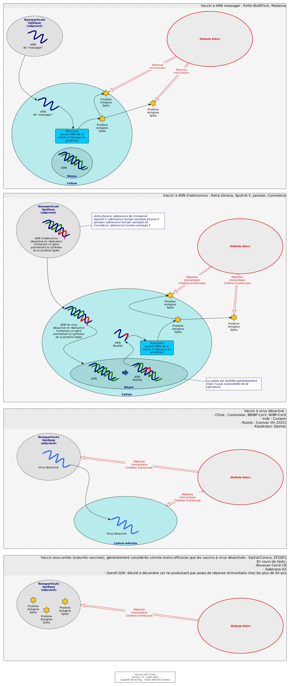

# Notes sur le Covid

## A propos des coronavirus

Les coronavirus sont des virus ARN de grande taille (de 26 000 à 32 000 bases), cause de maladies respiratoires comme le rhume. Le brin d'ARN est enveloppé d'une capsule appelée capside et parfois d'une envelope.

## Différents types de vaccins

Essentiellement, aujourd'hui, on compte quatre types de vaccins dont deux par thérapie génique. Le schéma ci-dessus tente de synthétiser leur mode de fonctionnement.

Les vaccins classiques (par exemple la grippe) sont basés sur l'injection de virus dits désactivés. Ces virus infectent des cellules et provoquent une réponse immunitaire qui permettra au corps de produire des anticorps protégeant contre le vrai virus quand il se présentera.

Les nouveaux vaccins utilisent un processus plus complexe pour stimuler l'immunité : ils encouragent nos cellules à produire une protéine 

## Liens

* [Structure des virus, cycle viral, physiopathologie des infections virales](http://www.chups.jussieu.fr/polys/viro/oldpoly/POLY.Chp.1.html "Structure des virus")

*(Mise à jour : 17 juillet 2021)*
