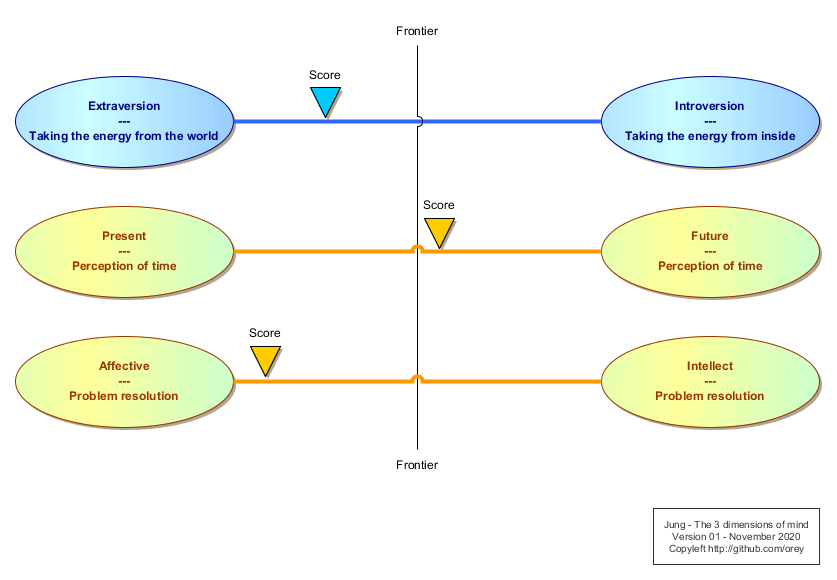
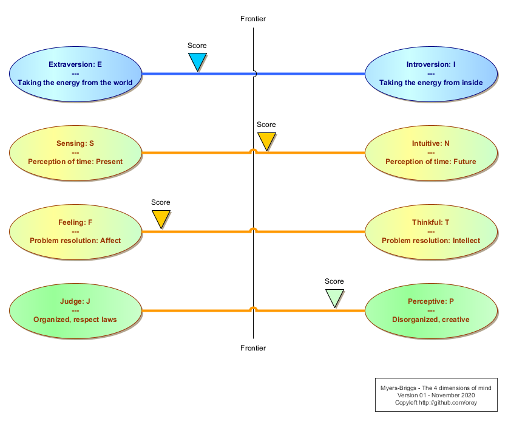

# Introduction au MBTI

## Les types psychologiques selon Jung

Jung est un psychologue, élève de Freud. Très vite, JUng se sépare de certaines thèses freudiennes pour développer sa propre psychologie, dénommée psychologie analytique.

Dans le cadre ses travaux, il écrit un livre, *Les types psychologiques*. Ce livre définit 8 types de personnalités. Ces 8 combinaisons sont le fruit de 3 dimensions étudiées dans la psyché humaine :

1. La source favorite d’énergie psychique ;
2. La perception du temps ;
3. La façon de résoudre des problèmes.

Chaque être humain possède un "curseur" le positionnant entre les deux extrêmes de chaque caractéristique "psychique" comme montré sur le schéma ci-dessous :

Suivant les différentes dominantes, la personnalité de la personne va être différente. De plus, les personnalités de différents profils ne se comprennent généralement pas ou pas complètement.

Deux psychologues américaines Myers & Briggs ont défini à partir de cette classification une quatrième dimension, plus américaine, la capacité de respecter les règles, versus un mode plus libre, plus créatif.

Cela a donné un jeu de 4 dimensions avec des lettres en anglais :

1. Introversion notée "I", et extraversion notée "E",
2. La personne vivant dans le présent sera nommé Sensing, noté "S", et celle vivant dans le futur, intuitive, noté "N",
3. La personne résolvant les problèmes avec l’affect sera Feeling, noté "F", et la personne intellectuelle sera thinkfull, noté "T",
4. La personne ordonnée, respectant les règles sera Judge, noté "J", et celle plus créative mais plus chaotique sera Perceptive, noté "P".

Dans le monde Myers-Briggs, il y aura donc 16 types de personnalités. Myers et Briggs sont à l’origine de questionnaires définissant le type psychologique de la personne qui y répond. On se retrouve positionné sur une grille similaire mais à 4 dimensions.

Des questionnaires MBTI (Myers-Briggs Type Indicator) existent gratuitement en ligne.

## Les types psychologiques en entreprise

### Structurellement, tout le monde ne se comprend pas

La première leçon apportée par ce modèle est de voir que l’on peut ne pas se comprendre sans que cela soit de la faute de quelqu’un.

### Des métiers en accord avec son profil psychologique

La seconde leçon est que certains types de métiers attirent clairement un certain type psychologique.

Par exemple :
* Métiers souvent choisis par les "Sensing" : comptabilité, logistique, production informatique, etc.
* Métiers souvent choisis par les "Intuitive" : bureau d’étude, création d’offres, études informatiques, artiste, etc.
* Métiers favoris des extravertis : vendeur, conférencier, chef de projet, etc.
* Métier favoris des introvertis : chercheur, comptabilité, développeur, etc.

Cela signifie aussi que certaines personnes peuvent être à contre-emploi dans un poste dont les besoins sont antinomiques avec la manière de fonctionner de leur psyché.

En un mot, la connaissance des types psychologiques compatibles avec les fonctions dans l'entreprise est très importante. Cette connaissance donne un cadre au très intuitif "the right man in the right place".

### Des équipes aux profils psychologiques trop homogènes

La troisième leçon est que le gens travaillent généralement avec des gens compatibles et recrutent des gens en accord avec leur profil (ils attendent un comportement qu’ils comprennent). Ainsi, des SF auront une tendance à recruter des SF, des NT des NT, etc.

Cela peut provoquer une bonne compréhension au sein de l'équipe mais un aveuglement collectif sur certaines dimensions des choses. Par exemple :

* Si toute l'équipe est F, il sera compliqué de résoudre les sujets de manière rationnelle ;
* Si toute l'équipe est N, il faudra que quelqu'un ramène parfois l'équipe sur les problèmes du présent.

Ces types psychologiques sont parfois utilisés dans des audits de direction générale, en cas de problème récurrent. Ils peuvent être demandés par les actionnaires. Ainsi, certains Comex découvrent, à l’occasion d’une passation de tests, que tous les membres ont le même type, ou sont identiques dans les deux caractéristiques du centre (S/N et F/T). Cela donne des problèmes graves de direction d’entreprise. Dans ce cas, il faut changer une partie du casting.

### La mode dans les profils psychologiques de dirigeants

Ces dernières décennies, certaines modes ont habité les profils des grandes entreprises. Pendant un temps, la mode était d'avoir des stragégies, ce qui favorisait les profils N (par exemple les ingénieurs). Le travers de ces profils est souvent de ne pas être assez S et de ne pas regarder trop précisément les problèmes financiers du présent.

A succédé à cette mode la mode des financiers (S) dirigeant les entreprises, et même des financiers rationnels (ST). Au revoir la stratégie de l'entreprise et bienvenue à des décisions dont les impacts moyen et long terme ne sont pas pris en compte.

De fait, il faut de tout dans une société, surtout à sa tête, sinon le Comex est rapidement biaisé.

### Un besoin de diversité psychologique

Il faut une certaine diversité psychologique pour qu'une société puisse voir toutes les composantes d'une situation, en particulier ses dimensions temporelle, rationnelle et humaine. Si les sujets de diversité sont très à la mode, la diversité psychologique est souvent la plus importante, et cela à de nombreux niveaux de l'arbre hiérarchique.

### Le défi du management

La connaissance des types psychologiques ouvre aussi la voie à un type de management plus conscient et plus mûr, que certains managers pratiquent déjà de manière "intuitive".

Un manager, connaissant son type, doit pouvoir déléguer à un autre type la réalisation de tâches pour lesquelles il n'est pas le plus adapté. Cela est objectivement compliqué dans la mesure où le manager devra faire confiance sur des dimensions du problème qui lui échappent ou avec lesquelles il ne se sent pas à l'aise.

C'est un des défis de la délégation.

### Types psychologiques et conflits en entreprise

Les types avec des dominantes opposées ne se comprenant pas, ils peuvent facilement entrer en conflit. Le conflit peut vite devenir grave alors même que le sujet du conflit n'est pas partagé.

Prenons l'exemple d'une personne NT et d'une personne SF. La personne NT étant rationnelle, analyse une situation actuelle et sa tendance à devenir grave dans le futur. Si elle s'ouvre de ce sujet à une personne SF impliquée, cette dernière aura une double réaction négative :

* Un sentiment d'agression personnelle ;
* Un malaise dû à une incapacité à se projeter dans le futur et donc à partager le diagnostic.

Si la personne NT insiste, il est fort probable que la personne SF décide que la personne NT lui en veut personnellement. Le conflit est devenu un conflit de personne et toute explication rationnelle du NT ne fera qu'aggraver la situation. Ayant projeté sur la personne NT sa propre lecture affective de la situation :

* La personne SF pourra conclure que la personne NT est son ennemi personnel ;
* La personne SF n'aura même pas compris le problème soulevé par la personne NT, car le point précédent aura éclipsé le message.

Si nous ajoutons de la hiérarchie dans cet exemple, nous pouvons voir à quel point la situation peut devenir grave. Si la personne SF est un manager, elle pourrait en venir à licencier la personne NT. Il est possible que ces mécaniques psychologiques expliquent, du moins en partie, l'adage de Sophocle "Ne tuez pas le messager".

L'incompatibilité de profils est particulièrement importante si les deux charactéristiques S/N et F/T sont en opposition :

* Nous avons vu un exemple de conflit entre NT et SF ;
* Le conflit entre NF et ST est aussi très dangereux : la personne ST verra la situation présente de manière abstraite et froide tandis que la personne NF verra la situation humaine future.

### Les efforts doivent être faits par les T

Il faut noter que les F auront toujours plus de mal à faire certains efforts, notamment en situation de stress, que les T. Pour autant, si les T voient que la réaction des F est disproportionnée, ils doivent absolument faire appel à leur empathie (F secondaire) pour arriver à se faire entendre.

Le sujet de trouver un terrain commun entre les S et N est plus compliqué car il est difficile de faire voir le futur à quelqu'un qui ne peut pas se projeter. Le S raisonnera sur la base de ce qu'il connaît et, au mieux, se projetera dans un futur qui est exactement comme le présent.

Dans ce cadre, la relation hiérarchique peut aider, en répartissant de manière intelligente les responsabilités entre ceux qui sont dans le présent et ceux qui planifient le futur. La hiérarchie peut aussi établir une relation de confiance entre les différents profils.

### La complexité de la transformation

Les différents types psychologiques jouent un rôle largement sous-estimé dans les échecs des projets, et notamment des projets de transformation en entreprise.

Au niveau de la direction de projet, tout d'abord, il est important d'avoir des profils N, et que ces derniers soient secondés par des S qui les éclairent sur les contraintes de la situation de départ.

Certains profils n'auront pas de mal à changer quand d'autres vivront mal le changement, notamment les S et notamment s'ils ont souffert personnellement pour mettre en place leurs modes de travail actuel (F).

## Conclusion

Les types psychologiques jouent un rôle majeur dans la capacité des organisations à évoluer et à faire face aux situations. Ce modèle de types psychologiques, qui n'est qu'un modèle parmi d'autres, est assez efficace pour donner des perspectives sur les causes profondes de certains problèmes.

